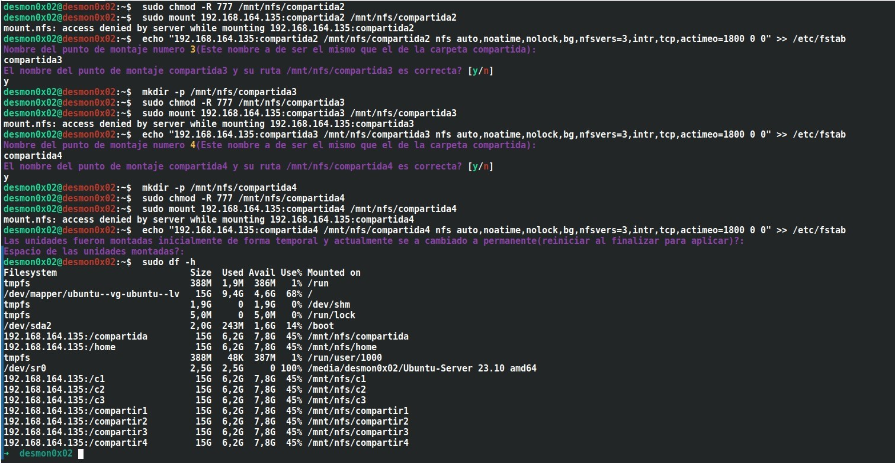
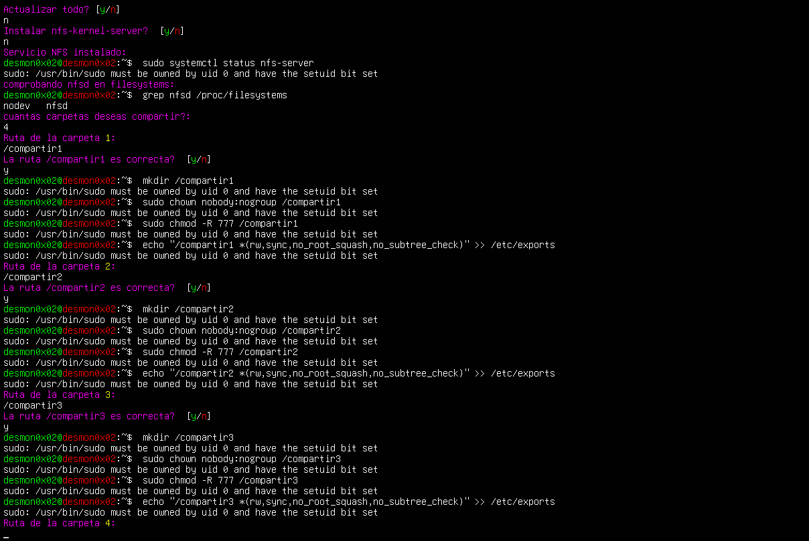
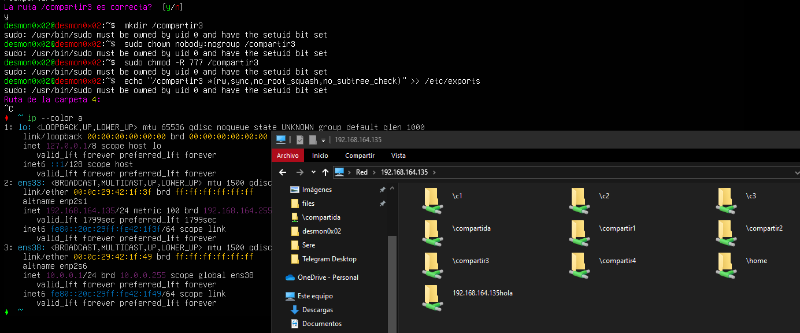
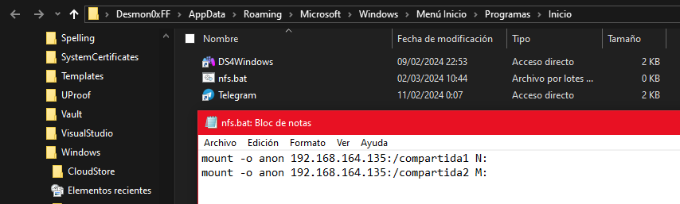
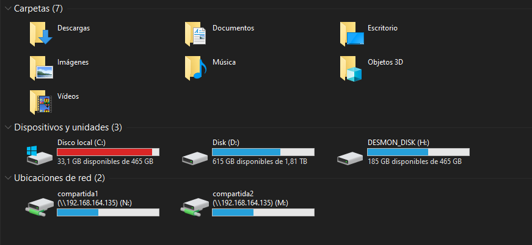

# NFS_script

----

Dos sencillos scripts, uno para abrir un servicio NFS y compartir carpetas rápidamente y otro para instalar el cliente NFS y montar estas carpetas compartidas.

----
Para poder usar NFS en el cliente, es necesario `nfs-common` y `rpcbind`
Ejecucion en el cliente NFS:

```bash
sh client_nfs.sh
```




-----

Para poder usar el servicio NFS es necesario instalar `nfs-kernel-server`
Ejecucion en el server NFS:

```bash
sh server_nfs.sh
```



-----

Desde windows podemos acceder usando el explorador de windows, poniendo la direccion del servidor NFS en la ruta:



Las carpetas compartidas por NFS pueden ser montadas en windows como discos, para esto entramos en "ejecutar" mediante el atajo `win + r` y ponemos `shell:startup`, en esta ruta se puede escribir archivos de lotes que seran ejecutados al inicio de windows de forma automatica.
Una vez en la ruta abierta, se creara un archivo .bat con lo siguiente:



La sintaxis es la siguiente:
```batch
mount -o anon <direccion del servidor NFS>:/<nombre de la carpeta> <letra de la unidad>:
```
La direccion del servidor a de existir y se a de tener acceso a dicho servidor. El nombre de la carpeta a de ser accesible por usuarios anonimos. La letra de unidad usada no a de estar asignada a ningun otro volumen.

Ejemplo practico con la carpeta compartida `compartida2`, con direccion de servidor `192.168.164.135` y letra de unidad `M:`:
```batch
mount -o anon 192.168.164.135:/compartida2 M:
```

Una vez crear el `.bat` podemos ejecutarlo manualmente por primera vez para montar directamente los volumenes sin necesidad de reinicio del sistema, o podemos realizar esta ultima opcion:



Como vemos ahora poseo dos volumenes mas llamados `compartida1` y `compartida2`

----